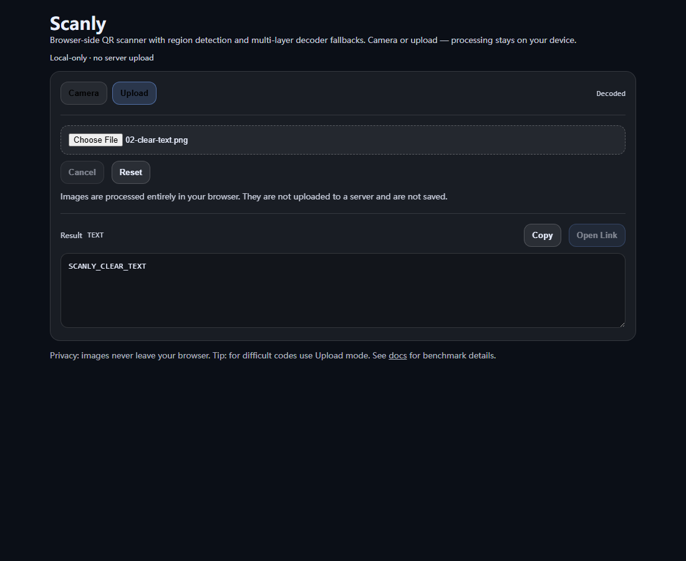

# Scanly SDK v2 Alpha.3 — preview

Scanly is a local-first barcode capture SDK foundation with a working browser QR reference application. The v2 alpha has one authoritative capture model: normalized upload, Worker, main-thread, Node, and sampled camera frames converge on a scenario-compiled Router backed by real operator and engine registries. It is not an ML model and has no image-upload backend.


**Live demo:** [https://qr-decoder-theta.vercel.app](https://qr-decoder-theta.vercel.app)



## Implemented in this branch

- UI-independent frame, result, error, engine, operator, router, and session contracts with explicit ownership and lifecycle
- Dependency-inverted engine, operator, and validator registries plus an eleven-operator compiled graph
- Versioned runtime-validated fast, balanced, and robust scenario profiles
- Web Worker upload decoding through the public Router with transferable pixel buffers and termination-based cancellation
- Job ownership checks that prevent stale results from overwriting a newer upload
- Top-N regions, deduplication, multi-scale crops, preprocessing, rotations, jsQR, and ZXing fallback
- Per-frame bounded intermediate cache shared by repeated preprocessing/decoder attempts
- Multiple-code completeness contracts rather than “one code found” success
- Local-only semantic parsing for URL, Wi-Fi, vCard, email, telephone, SMS, geo, calendar, and prepared GS1 forms
- Reproducible canonical benchmark, immutable baseline, regression-gate, coverage, and cross-browser Playwright infrastructure
- Local-only privacy: no image upload API, storage, account, analytics, or tracking

QR Code Model 2 is the only format currently implemented and tested. Other symbologies in the public capability vocabulary are unsupported, not hidden support claims.

## Internal fixture benchmark

This is Scanly's internal regression suite—not universal accuracy, a third-party comparison, or an ML evaluation. Hard failures stay in the denominator.

<!-- BENCHMARK_SUMMARY_START -->
| Metric | Value |
| --- | ---: |
| Evidence status | **Legacy one-iteration development data; Alpha.3 canonical regeneration pending** |
| Internal fixtures | 74 |
| Generated fixtures | 65 |
| Project-owned photos | 9 |
| Success on fixture suite | **73/74 (98.6%)** on the current 74-case project fixture suite |
| Positive decode recall | **62/63 (98.4%)** |
| Negative false positives | **0/11 (0.0%)** |
| Remaining failure | `14-damaged` |
| Benchmark date | 2026-07-16 |
| Manifest | [fixtures/manifest.json](fixtures/manifest.json) |
| Tracked JSON | [benchmark-results/latest.json](benchmark-results/latest.json) (not current canonical evidence) |
| Parallel execution | **Pending final Alpha.3 comparison evidence** |
<!-- BENCHMARK_SUMMARY_END -->

See [the full benchmark](docs/benchmark.md) and [fixture methodology](docs/testing.md).

Benchmark output is deliberately separated: ordinary local runs write ignored development reports, while `benchmark:canonical-candidate` creates one clean candidate profile report (the deprecated `benchmark:canonical` name remains an alias). `benchmark:assemble-canonical` combines Fast, Balanced, Robust, and Comparison reports into a verified manifest; `benchmark:update-canonical` atomically updates tracked aliases and documentation; `benchmark:freeze` creates one immutable profile baseline; and `benchmark:activate` atomically activates all three baselines. Canonical evidence requires at least one warmup, three measured iterations per fixture, and a clean Git repository.

Profile intent is explicit: `fast` is the latency-first camera pass and accepts lower recall; `balanced` is the upload and general-purpose default; `robust` is the highest-cost bounded batch/offline completeness profile. The reference app uses fast for initial camera frames, derived balanced-strength escalation after misses, balanced for uploads, and robust only when explicitly selected.

## Features

- Camera scanning and uploaded image decoding
- Clear/inverted/small-in-large/damaged/multiple QR fallbacks within bounded attempt and time budgets
- Real cancel, stale-job protection, and recoverable Worker errors
- HTTP/HTTPS-only link actions; all other payloads remain plain text
- 25 MiB and 24-megapixel upload safety limits

## Workspace boundaries

| Workspace | Ownership |
| --- | --- |
| `apps/web-demo` | Next.js reference application; consumes SDK APIs |
| `packages/core` | dependency-light contracts, registries, compiler, router, session, bounded artifacts, and engine-agnostic QR primitives |
| `packages/browser` | file loading, Worker ownership, camera source lifecycle |
| `packages/node` | Sharp-isolated Node image loading and default engine composition |
| `packages/react` | thin React lifecycle adapter |
| `packages/scenario-schema` | scenario v2 types, validation, profiles |
| `packages/parsers` | side-effect-free semantic parsing |
| `packages/benchmark` | benchmark schema, fixture evaluation, gates |
| `engines/jsqr`, `engines/zxing-js` | engine-plugin contract adapters |

- [Architecture](docs/architecture.md)
- [SDK usage](docs/sdk/usage.md)
- [Public API and lifecycle](docs/sdk/public-api.md)
- [Scenarios](docs/scenarios/configuration.md)
- [Decoding pipeline](docs/decoding-pipeline.md)
- [Benchmark methodology](docs/benchmarking/methodology.md)
- [v1 migration](docs/migration/v1-to-v2.md)
- [Maintenance policy](docs/maintenance.md)

## Local development

Verified in CI on Node.js 20 and locally on Node.js 24; the supported maintenance range is Node.js 20–24 with npm 10 or newer.

```bash
git clone https://github.com/Yangjunjie-Lin/Scanly.git
cd Scanly
npm ci
npm run fixtures:generate
npm run scenarios:generate
npm run dev
```

For production-equivalent verification:

```bash
npm run check
npm run test:e2e
npm run benchmark:smoke
npm run benchmark:compare
npm run bundle:analyze
```

Run `npm run benchmark` for ignored development evidence after decoding-pipeline or fixture-contract changes. Create each clean candidate with `npm run benchmark:canonical-candidate -- --profile=<fast|balanced|robust>`, then follow the assemble, update, freeze, and activate lifecycle above. Candidate reports are not committed canonical evidence until a verified manifest has been approved and installed.

## Browser support

| Browser | Support |
| --- | --- |
| Chrome / Edge | Camera and upload supported |
| Firefox | Upload supported; camera depends on browser/device permissions |
| Safari / iOS Safari | Upload and camera supported with HTTPS and platform permission constraints |

Automated desktop coverage is not a claim that every browser/device combination has been tested. Camera E2E remains Chromium-only because CI media-device simulation is not stable across all engines.

The seven-fixture PR job is **Browser Benchmark Smoke**. **Browser Full Benchmark** covers all suitable fixtures only on manual or scheduled runs; neither substitutes for a certified physical-device lab.

## Privacy and security

- Images are processed locally and are never sent to an upload API or stored by Scanly.
- The project contains no analytics or user-behavior tracking.
- Camera tracks stop after use or when leaving Camera mode.
- Clipboard writes require an explicit button action and browser permission.
- Benchmark images are repository fixtures: deterministic generated cases or project-owned photos.
- QR payloads render as text; only parsed `http:` and `https:` URLs can enable **Open Link**.

See [SECURITY.md](SECURITY.md) for vulnerability reporting.

## Preview limitations

- Severely damaged or occluded modules may remain undecodable; `14-damaged` is intentionally retained.
- Strong 3D perspective warp may exceed the heuristic pipeline.
- Camera support depends on HTTPS, permissions, browser, and device hardware.
- File and pixel limits reject unusually large images before full RGBA allocation.
- Micro QR, rMQR, Data Matrix, PDF417, Aztec, 1D formats, ZXing-C++ WASM, native bindings, Python, and .NET bindings are not implemented.
- Desktop browser automation is not real iOS/Android device validation; torch, zoom, orientation, and long-running camera behavior still need a physical device lab.
- Statistically calibrated confidence is not available from the default QR path. Corners, raw bytes, and symbology identifiers are exposed only when the selected engine returns them; no input path fabricates metadata.

## Project status

**SDK v2 alpha preview.** Scanly now has a unified, dependency-inverted, scenario-driven runtime that can be developed toward commercial barcode-capture maturity without another core architectural rewrite. Industrial or production readiness is not claimed: the dataset is internal, physical-device coverage is absent, only QR Code Model 2 is implemented, and the alpha API may change.

## License

[MIT](LICENSE) · [Contributing](CONTRIBUTING.md) · [Changelog](CHANGELOG.md)
