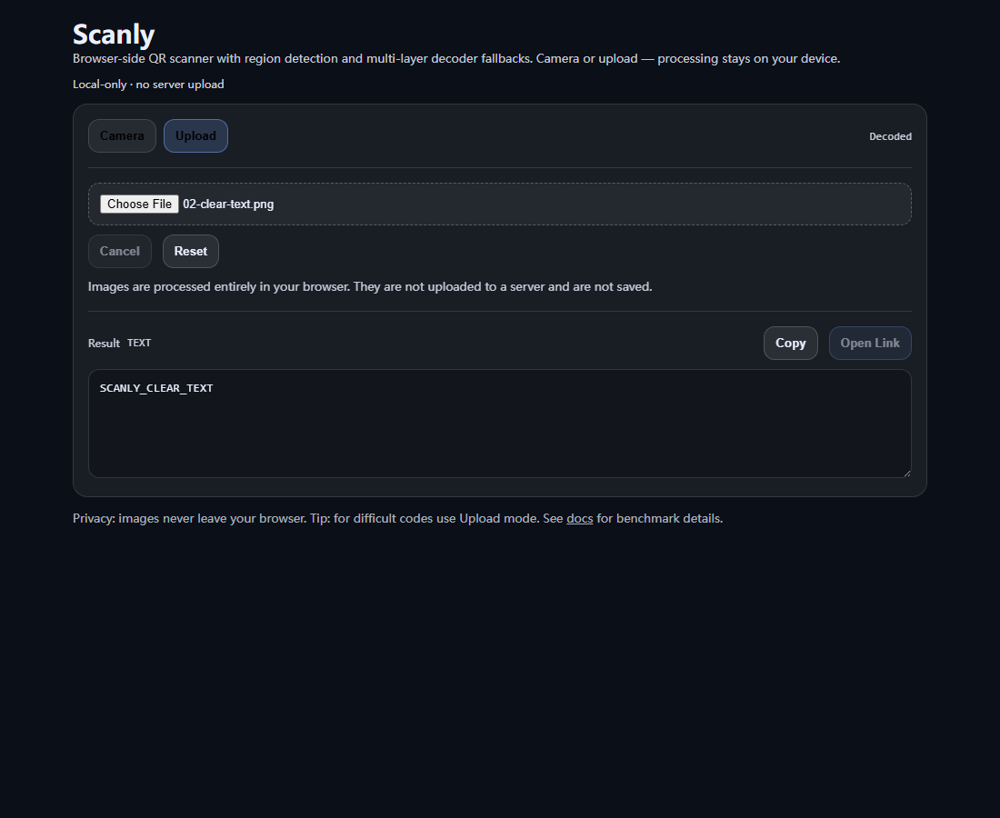

# Scanly SDK v2 Beta 4 — physical device and camera platform hardening

Scanly is a local-first barcode capture SDK foundation with a working browser reference application. Beta 4 adds a dedicated Device Lab, fail-closed physical-evidence contracts, bounded camera recovery, constraint negotiation, lifecycle generation safety, and long-session reporting while preserving Beta 3 industrial recovery, Beta 2 tracking/batch, Beta 1 real-time behavior, and Alpha.5 multi-symbology compatibility. The harness is complete; physical mobile validation is pending. This is not production certification.


**Live demo:** [https://qr-decoder-theta.vercel.app](https://qr-decoder-theta.vercel.app)



## Implemented in this branch

- UI-independent frame, result, error, engine, operator, router, and session contracts with explicit ownership and lifecycle
- Dependency-inverted engine, operator, and validator registries plus an eleven-operator compiled graph
- Versioned runtime-validated fast, balanced, and robust scenario profiles
- Web Worker upload decoding through the public Router with transferable pixel buffers and termination-based cancellation
- Job ownership checks that prevent stale results from overwriting a newer upload
- Top-N regions, deduplication, multi-scale crops, preprocessing, rotations, jsQR, and ZXing fallback
- Per-frame bounded intermediate cache shared by repeated preprocessing/decoder attempts
- Multiple-code completeness contracts rather than “one code found” success
- Local-only semantic parsing for URL, Wi-Fi, vCard, email, telephone, SMS, geo, calendar, and prepared GS1 forms
- Reproducible canonical benchmark, immutable baseline, regression-gate, coverage, and cross-browser Playwright infrastructure
- Local-only privacy: no image upload API, storage, account, analytics, or tracking
- Optional ZXing-C++ WebAssembly engine with a pinned local asset, SHA-256 verification, lazy/deduplicated initialization, typed failures, bounded native results, and explicit disposal
- Browser/Worker/Node engine composition ordered as jsQR → ZXing-C++ WASM → ZXing-JS, with Fast protecting first-frame cold-start latency and Balanced/Robust using an early native fallback

Alpha.5 explicitly supports QR Code Model 2, Data Matrix ECC 200, PDF417, Code 128, EAN-13, EAN-8, UPC-A, and UPC-E. QR-only remains the default for existing consumers. The pinned ZXing-C++ WASM adapter receives a format mask for every request; jsQR and ZXing-JS remain QR-only engines. See [symbologies](docs/symbologies.md) for support boundaries.

## Branch and release status

- `main` is the unchanged v1.3 Stable line.
- `develop/sdk-v2` contains the merged Beta 3 industrial robustness foundation.
- `architecture/sdk-v2-beta4-device-platform-hardening` is the active Beta 4 development branch; it was created from the Beta 3 merge commit and does not modify `main`.
- Alpha.5 is an internal integration snapshot, not production-certified evidence. No Alpha.5 tag, GitHub Release, npm publication, Stable claim, or `Latest` release is authorized.
- Beta 1 remains development evidence. No Beta tag, GitHub Release, npm publication, Stable claim, or `Latest` release is authorized.
- Beta 4 status is `DEVICE_HARNESS_GO` / `PHYSICAL_DEVICE_VALIDATION_PENDING`. No real iOS, Android, desktop-camera, remote-device-farm, or 30-minute physical soak session is currently stored in this repository.

### Beta 4 physical-device hardening foundation

The separate [Device Lab source](apps/web-demo/app/device-lab/page.tsx) composes `MediaStreamCameraFrameSource` and `ScannerSession`; it displays only browser/camera reported settings, capabilities, constraints, viewport, orientation, device pixel ratio, lifecycle events, resource observations, and controlled-memory statistics. Unsupported values are `unsupported` or `unavailable`—never guessed. Exports are review-required drafts, not admissible evidence.

The fixed [physical test protocol](device-lab/manifest.json), [Ground Truth](device-lab/test-targets/ground-truth.json), deterministic printable/screen targets, [evidence schema](device-evidence/schema.json), and `npm run device:evidence:verify` keep simulated, desktop-camera, physical-mobile, and remote-physical-device evidence distinct. CI validates these contracts but never claims access to a phone. See the [Beta 4 validation protocol](docs/beta4-device-validation.md) and [platform compatibility matrix](docs/platform-compatibility.md).

Camera acquisition now negotiates preferred constraints through bounded fallbacks, maps platform failures to typed camera errors, and invalidates scanner generations for camera switch, orientation, resolution, background/foreground, and recovery transitions. `CameraRecoveryController` bounds track-ended and temporary source recovery; it cannot restart indefinitely. These are automated contracts, not physical-device results.

## Internal fixture benchmark

This is Scanly's internal regression suite—not universal accuracy, a third-party comparison, or an ML evaluation. Hard failures stay in the denominator.

### Historical frozen evidence

The last fully frozen evidence is **Alpha.4 r4** (`v2-alpha4-r4`). Its dataset is the legacy 74-fixture QR suite. The canonical evidence identity is `alpha4-cc1a5968d39ffbea`, sourced from commit `a139c8b7064a83c26cfba5a9ff4fb75c3f6c9f83` and tree `31da835767e4d691716f3c327f4cbb0b615d95ac`, as recorded by the [canonical manifest](benchmark-results/canonical/canonical-evidence-manifest.json) and [baseline registry](benchmark-results/baselines/registry.json).

<!-- HISTORICAL_BENCHMARK_SUMMARY_START -->
| Historical Alpha.4 r4 canonical evidence | Value |
| --- | ---: |
| Legacy QR fixtures | 74 |
| Generated fixtures | 65 |
| Project-owned photographs | 9 |
| Balanced success | **73/74 (98.6%)** |
| Positive decode recall | **62/63 (98.4%)** |
| Negative false positives | **0/11 (0.0%)** |
| Remaining failure | `14-damaged` |
| Parallel execution | **experimental** (measured against sequential parity policy) |
| Benchmark date | 2026-07-18 |
| Fixture manifest | [fixtures/manifest.json](fixtures/manifest.json) |
| Canonical JSON | [benchmark-results/canonical/latest.json](benchmark-results/canonical/latest.json) |
| Canonical CSV | [benchmark-results/canonical/latest.csv](benchmark-results/canonical/latest.csv) |
<!-- HISTORICAL_BENCHMARK_SUMMARY_END -->

### Current Alpha.5 integration corpus

Alpha.5 integration evidence is development evidence. It is not frozen canonical release evidence.

### Beta 1 real-time scanner foundation

The merged Beta 1 baseline introduces the SDK-owned `ScannerSession`, `FrameScheduler`, `FrameQualityAnalyzer`, bounded Fast/Balanced/Robust escalation, temporal confirmation, repeat suppression, temporal ROI reuse, capability detection, and deterministic camera simulation. React is an adapter only; it does not own decode, Worker, temporal, or memory state.

The real-time benchmark has 20 semantic Ground Truth scenarios with scenario-specific drivers: lifecycle actions, pixel quality, decode profiles, ROI requests, Worker recovery, geometry identity, and backpressure are executed and observed rather than inferred from scenario names. Report schema `2.0-beta1` stores independent `expected` and `observed` values, assertion results and failure reasons, metrics, and event/profile/diagnostic timelines. False-confirmed, stale-event, repeat, physical-instance, drop, and queue gates are derived from those reports rather than hard-coded.

Reliability evidence is split by scope. Scanner Core Soak runs 10,000 frames with a fake decoder and records `workerEvidence: "not-applicable"`; it validates scheduler, temporal, ownership, lifecycle, and controlled-memory cleanup, not Worker/WASM behavior. The separate pull-request soak runs at least 1,000 actual frames through `BrowserScannerFrameDecoder`, one persistent `DecodeWorkerClient`, a browser Worker, and ZXing-C++ WASM. A scheduled/manual extended tier runs 10,000 real Worker/WASM frames. The Browser Benchmark runs real-time smoke, lifecycle, repeat, and backpressure cases in Chromium, Firefox, and WebKit.

Camera unit coverage validates unsupported capabilities, manual override, auto-zoom cooldown and clamp, anti-oscillation state, and source-switch refresh. It is not physical auto-zoom evidence. The Beta 1 photo gate uses an audited open-license camera-photo cohort; project-owned photos remain optional supplemental evidence and are never fabricated or inferred from Internet assets. Beta 1 runtime integration passed and was merged into `develop/sdk-v2`; [Issue #13](https://github.com/Yangjunjie-Lin/Scanly/issues/13) continues to track non-blocking physical-camera/device evidence. No `v2-beta1-r1` canonical evidence activation was performed.

See [Beta 1 real-time runtime](docs/beta1-realtime-runtime.md) for the lifecycle, bounded escalation, temporal correctness, memory, and evidence boundaries.

### Beta 3 industrial difficult-barcode recovery foundation

Beta 3 introduces heuristic difficulty diagnosis, a recovery-route registry, and a budgeted recovery planner. Recovery is deterministic and transforms only observable pixels: neural super-resolution, generative inpainting, and payload guessing are excluded. The default camera path remains bounded; the higher-cost `industrial` profile is explicit, and `dpm-experimental` remains opt-in. `ScanEvidence.evidenceScore` is supporting evidence rather than a calibrated probability.

Data Matrix ECC 200 remains supported. Direct Part Mark Data Matrix is only an experimental recovery profile and is not industrial DPM certification. Recovery preserves inverse geometry mappings so published corners remain in original-frame coordinates and can enter the existing tracker.

### Beta 2 barcode tracking and batch scan foundation

Beta 2 composes `BarcodeTracker` and `BatchScanSession` over the existing `ScannerSession` observation-set boundary. A single bounded multi-code decode publishes every valid frame observation; deterministic Hungarian assignment then associates observations with stable physical tracks using payload/format compatibility, geometry, IoU, motion, and elapsed-time evidence. `trackId` and `physicalInstanceId` are not payload keys, so equal UPC labels on separate moving objects remain distinct.

Track lifecycle is explicit (`tentative`, `confirmed`, `lost`, `retired`) with bounded occlusion recovery. In explicit `decodeMode: "tracking"`, `ScannerTrackingRuntime` applies `TrackROISet` predicted envelopes, uncovered-region work, and periodic full-frame recovery while keeping one decoder call per admitted frame. `TrackOverlayModel` keeps renderer data inside the SDK boundary while React, Canvas, or SVG owns presentation only.

Batch composition supports continuous, expected-count, checklist, and unique-physical-instance modes. Expected counts and checklist quantities are satisfied by confirmed physical tracks, not repeated decoder events or `Set(payload)` cardinality; checklist state reports matched, missing, unexpected, and duplicate items.

The development evidence harness defines 34 independent Ground Truth scenarios across basic, multi-object, identity, lifecycle, batch, and stress families. It evaluates transition order, identity switches, fragmentation, false confirmed tracks, transient noise, matched/missed observations, track recall/precision, and false batch completion. It records 1/4/8/16-target performance baselines and a separate 32-target bounded-association case. Separate 10,000-frame Core and 1,000-frame real Worker/WASM tracking soaks retain their evidence boundaries. The deterministic browser subset covers single target, equal-payload instances, crossing, occlusion, and expected-count completion in Chromium, Firefox, and WebKit.

See [Beta 2 tracking and batch scan](docs/beta2-tracking-batch.md). This remains development/integration evidence: it does not claim industrial tracking, warehouse certification, AR MatrixScan parity, or physical-device validation.

See [Beta 3 industrial difficult-barcode recovery](docs/beta3-industrial-recovery.md) for recovery budgets, route boundaries, evidence/conflict semantics, coordinate transforms, Worker ownership, corpus provenance, and the DPM experimental boundary.

<!-- ALPHA5_INTEGRATION_SUMMARY_START -->
| Current Alpha.5 development evidence | Value |
| --- | ---: |
| Generated Alpha.5 fixtures | 146 |
| Curated open-license camera photographs | **16 (minimum 12)** |
| Single-format positives | 113 |
| Mixed positives | 15 |
| Negative fixtures | 34 |
| Generated clean | **15/15** |
| Generated difficult | **75/85** |
| Mixed completeness | **12/12** |
| GS1 recognition | **8/8** |
| False positives | **0** |
| Accepted-format misclassifications | **0** |
| Invalid-checksum acceptances | **0** |
| Optional project-owned photographs | **0** |
| Corpus manifest | [fixtures/alpha5/manifest.json](fixtures/alpha5/manifest.json) |
| Optional project-photo manifest | [fixtures/alpha5/project-photos/manifest.json](fixtures/alpha5/project-photos/manifest.json) |
<!-- ALPHA5_INTEGRATION_SUMMARY_END -->

The Beta 1 photo gate is a curated open-license camera-photo cohort kept separate from optional project-owned evidence. Its 16 SHA-256-pinned originals cover Data Matrix 3, PDF417 3, Code 128 4, and EAN/UPC 6; they record 21 visible physical instances and pass exact all-format ZXing-C++ WASM Ground Truth verification for 20/20 `(format, payload, isGs1)` semantic results. Every entry records original bytes, a trusted source, redistributable license evidence, camera-photo review, and sensitive-data review. The three PDF417 photographs are pinned to an Apache-2.0 ZXing commit whose history identifies them as Android-camera real-world images. Physical-camera/device evidence remains independent and unavailable; it is not represented by this cohort and does not block Beta 2 integration development.

Curated open-license camera photographs satisfy the Beta 1 photo gate but do not constitute physical-camera/device evidence or project ownership.

See [the full benchmark](docs/benchmark.md) and [fixture methodology](docs/testing.md).

Benchmark output is deliberately separated: ordinary local runs write ignored development reports, while `benchmark:canonical-candidate` creates one clean candidate profile report (the deprecated `benchmark:canonical` name remains an alias). `benchmark:assemble-canonical` combines Fast, Balanced, Robust, Comparison, and Symbologies reports into a verified schema 2.1 manifest; `benchmark:update-canonical` atomically updates tracked aliases and documentation; `benchmark:freeze` creates one immutable profile baseline; and `benchmark:activate` atomically activates all three baselines. Canonical profile and Comparison evidence requires at least one warmup, three measured iterations per fixture, and a clean Git repository; the Symbologies report records the complete per-format gate result.

Profile intent is explicit: `fast` is the latency-first camera pass and accepts lower recall; `balanced` is the upload and general-purpose default; `robust` is the highest-cost bounded batch/offline completeness profile. The reference app uses fast for initial camera frames, derived balanced-strength escalation after misses, balanced for uploads, and robust only when explicitly selected.

## Features

- Camera scanning and uploaded image decoding
- Clear/inverted/small-in-large/damaged/multiple QR fallbacks within bounded attempt and time budgets
- Real cancel, stale-job protection, and recoverable Worker errors
- HTTP/HTTPS-only link actions; all other payloads remain plain text
- 25 MiB and 24-megapixel upload safety limits

## Workspace boundaries

| Workspace | Ownership |
| --- | --- |
| `apps/web-demo` | Next.js reference application; consumes SDK APIs |
| `packages/core` | dependency-light contracts, registries, compiler, router, session, bounded artifacts, and engine-agnostic QR primitives |
| `packages/browser` | file loading, persistent Worker ownership, `ScannerSession`, frame scheduling, temporal camera runtime |
| `packages/node` | Sharp-isolated Node image loading and default engine composition |
| `packages/react` | thin React lifecycle adapter |
| `packages/scenario-schema` | scenario v2 types, validation, profiles |
| `packages/parsers` | side-effect-free semantic parsing |
| `packages/benchmark` | benchmark schema, fixture evaluation, gates |
| `engines/jsqr`, `engines/zxing-js` | JavaScript engine-plugin contract adapters |
| `engines/zxing-cpp-wasm` | optional ZXing-C++ WASM loader, native boundary, pinned asset, integrity metadata, and lifecycle |

- [Architecture](docs/architecture.md)
- [SDK usage](docs/sdk/usage.md)
- [Public API and lifecycle](docs/sdk/public-api.md)
- [Scenarios](docs/scenarios/configuration.md)
- [Decoding pipeline](docs/decoding-pipeline.md)
- [Beta 3 industrial recovery](docs/beta3-industrial-recovery.md)
- [Benchmark methodology](docs/benchmarking/methodology.md)
- [v1 migration](docs/migration/v1-to-v2.md)
- [Maintenance policy](docs/maintenance.md)

## Local development

Verified in CI on current Node.js 20 LTS and locally on Node.js 24; the supported maintenance range is Node.js 20.16–24 with npm 10 or newer.

```bash
git clone https://github.com/Yangjunjie-Lin/Scanly.git
cd Scanly
npm ci
npm run wasm:verify
npm run fixtures:generate
npm run scenarios:generate
npm run dev
```

For production-equivalent verification:

```bash
npm run check
npm run wasm:build
npm run wasm:verify
npm run test:e2e
npm run benchmark:smoke
npm run fixtures:verify-industrial
npm run benchmark:industrial -- --full --gate
npm run benchmark:industrial:negative -- --full --gate
npm run test:industrial:soak
npm run benchmark:compare
npm run bundle:analyze
```

Run `npm run benchmark` for ignored development evidence after decoding-pipeline or fixture-contract changes. Create each clean candidate with `npm run benchmark:canonical-candidate -- --profile=<fast|balanced|robust>`, then follow the assemble, update, freeze, and activate lifecycle above. Candidate reports are not committed canonical evidence until a verified manifest has been approved and installed.

## Browser support

| Browser | Support |
| --- | --- |
| Chrome / Edge | Camera and upload supported |
| Firefox | Upload supported; camera depends on browser/device permissions |
| Safari / iOS Safari | Upload and camera supported with HTTPS and platform permission constraints |

Automated desktop coverage is not a claim that every browser/device combination has been tested. The deterministic ScannerSession Browser Benchmark suite runs in Chromium, Firefox, and WebKit; media-device camera E2E remains Chromium-only because CI device simulation is not stable across all engines.

The seven-fixture PR job is **Browser Benchmark Smoke**. **Browser Full Benchmark** covers all suitable fixtures only on manual or scheduled runs; neither substitutes for a certified physical-device lab.

## Privacy and security

- Images are processed locally and are never sent to an upload API or stored by Scanly.
- The project contains no analytics or user-behavior tracking.
- Camera tracks stop after use or when leaving Camera mode.
- Clipboard writes require an explicit button action and browser permission.
- Benchmark images are repository fixtures: deterministic generated cases, project-owned photos, or separately attributed third-party open-license photographs.
- QR payloads render as text; only parsed `http:` and `https:` URLs can enable **Open Link**.

See [SECURITY.md](SECURITY.md) for vulnerability reporting.

## Preview limitations

- Severely damaged or occluded modules may remain undecodable; `14-damaged` is intentionally retained.
- Strong 3D perspective warp may exceed the heuristic pipeline.
- Camera support depends on HTTPS, permissions, browser, and device hardware.
- File and pixel limits reject unusually large images before full RGBA allocation.
- Micro QR, rMQR, Aztec, Micro PDF417, DotCode, MaxiCode, GS1 DataBar/Composite, postal codes, and deferred 1D formats are not implemented. Native mobile bindings, Python, and .NET bindings are also outside Alpha.5.
- The Alpha.5 asset is standard WASM. Safe SIMD detection exists, but no SIMD artifact or acceleration claim is shipped until a reproducible SIMD build is measured.
- WASM cancellation is cooperative during synchronous native execution: late delivery is suppressed, but native code is not preempted.
- Desktop browser automation is not real iOS/Android device validation; torch, zoom, orientation, and long-running camera behavior still need a physical device lab.
- Statistically calibrated confidence is not available from the default QR path. Corners, raw bytes, and symbology identifiers are exposed only when the selected engine returns them; no input path fabricates metadata.

## Project status

**SDK v2 Beta 4 development preview.** `DEVICE_HARNESS_GO`; `PHYSICAL_DEVICE_VALIDATION_PENDING`. The Device Lab and fail-closed evidence foundation are available, but no physical mobile matrix or 30-minute physical soak has been submitted. Industrial certification, all-iPhone/all-Android coverage, commercial parity, Stable, and production readiness are not claimed.

## License

[MIT](LICENSE) · [Contributing](CONTRIBUTING.md) · [Changelog](CHANGELOG.md)
